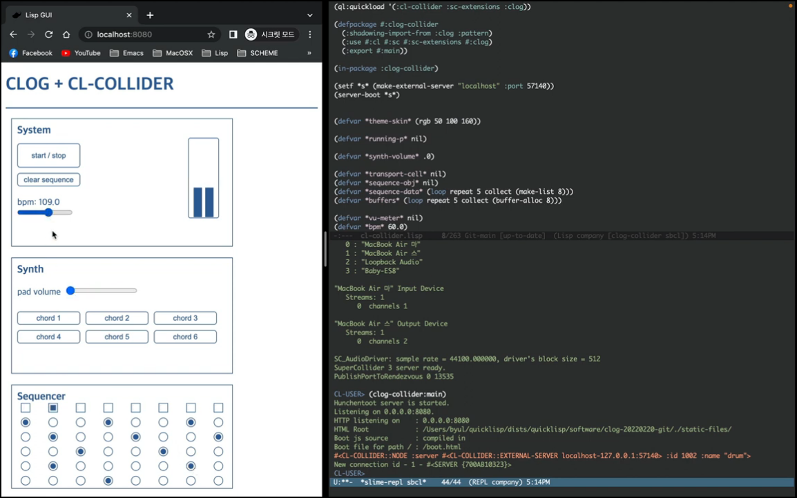
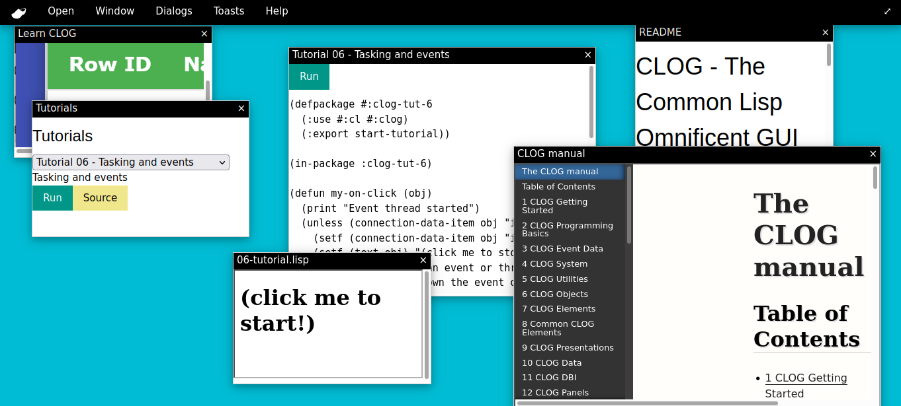

# Example Apps

Here you’ll find carefully curated external links to real-world examples of CLOG-powered applications, high-quality tutorials and learning paths for Common Lisp, official and community-driven reference materials, useful libraries, tools, and related projects. Whether you’re just getting started or hunting for advanced techniques and inspiration, these resources are hand-picked to help you make the most of CLOG and the Common Lisp ecosystem. Dive in and happy hacking!

## Examples of CLOG on the web

If you spot CLOG being used in the wild, please let us know! We would love to hear about the project and featurure it here!

### Moldable Inspector
!!! quote
    "A moldable Common Lisp object inspector based on CLOG. While this is a generic Common Lisp object inspector, much like Clouseau), my motivation for developing it is more specific: I want to make it easier to present computer-aided research with a large cognitive surface. In more familiar terms, I want to empower scientists to share their code, data, and associated narratives in a way that makes them comprehensible to their peers."

:fontawesome-brands-github:{ .icon } **PROJECT REPO:** [Moldable Inspector](https://codeberg.org/khinsen/clog-moldable-inspector){:target="_blank"}

### CLOG Collider Experience
!!! abstract
    A wonderful CLOG web based interface to the wonderful [SuperCollider](https://supercollider.github.io/){:target="_blank"} audio systhesis and algorithmic composition. This project uses the terrific [cl-collider](https://github.com/byulparan/cl-collider){:target="_blank"} Common Lisp library as an interface to SuperCollider also written by the same author!

:fontawesome-brands-github:{ .icon } **PROJECT REPO:** [CLOG Collider Experience ](https://github.com/byulparan/clog-collider-experience/tree/main){:target="_blank"}

### CLOG on iOS and Android
!!! quote
     "This doesn't use a web-server, only a simple websocket-server. You'll need a fork of CLOG that works on mobile. Tested on desktop (Linux/macOS) and mobile (android/iOS). Please note that I'm new to CLOG, so I only tested this simple example as a proof of concept. For more involved examples it will probably need some modification/adaption."

:fontawesome-brands-reddit:{ .icon } **Reddit:** [Original Thread](https://www.reddit.com/r/lisp/comments/tl46of/would_it_be_cool_to_run_a_clog_app_on_mobile_you/){:target="_blank"}

:fontawesome-brands-dropbox:{ .icon } **Link to:** [APK from Dropbox](https://www.dropbox.com/s/h5wy57niq4g12ec/CLOG-demo.apk?dl=0){:target="_blank"}

:fontawesome-brands-github:{ .icon } **PROJECT REPO:** [CLOG on iOS and Android](https://gitlab.com/eql/lqml/-/tree/master/examples/clog-demo){:target="_blank"}

### Learn CLOG Dashboard
!!! abstract
    A great little example of CLOG desktop widgets and how they can be combined in intersting ways to build a dynamic dashboard interface..

:fontawesome-brands-github:{ .icon } **PROJECT REPO:** [Learn CLOG Dashboard](https://gist.github.com/mmontone/3a5a8a57675750e99ffb7fa64f40bc39){:target="_blank"}

### CLOGPower.com
!!! abstract
    And, of course, the official CLOG website. Currently under active development and soon to be the showcase of the power of CLOG!

:smile: **Home Page:** [https://CLOGPOWER.com](https://clogpower.com/){:target="_blank"}

